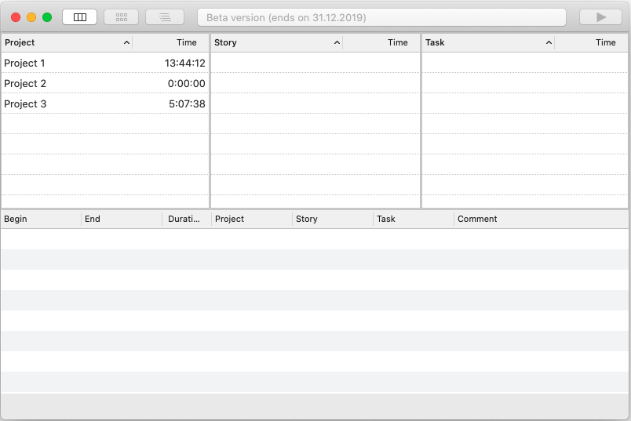
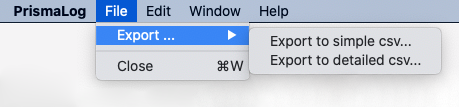

Introduction
------------

After startup, the application shows all existing projects (or empty tables). The layout shows projects, the corresponding stories for each project and the tasks for each project. A multiple number of log entries can be created for each task.

### Definition

A project is a distinct target of related activities. Related activities (tasks) are summarized as stories. Since tasks can also be stopped, a task can contain a large number of logs.

For example: A story represents a user feature or use case. A task represents a set of engineering work.

Functions
---------

Projects can be created at any time; a double-click on a project line opens project editing.

Each project (as well as each story and task) gets a name and can (optionally) get a comment.

To create new projects (stories or tasks), use the buttons in the toolbar. The left button is used to create a new project. The second button is used to create stories for a project. To do this, the corresponding project must be selected beforehand.

The third button for new tasks has to be used accordingly. Only after selecting a story a task can be created for this story. - The recording of the time can be started after a task has been selected (the button with the triangle on the right hand side of the toolbar).

### Export

The recorded log entries can be exported as a csv file. This makes it possible to import them into other applications in order to analyze the workload.

The export function can be found in the menu bar of the application at "File -> Export"

