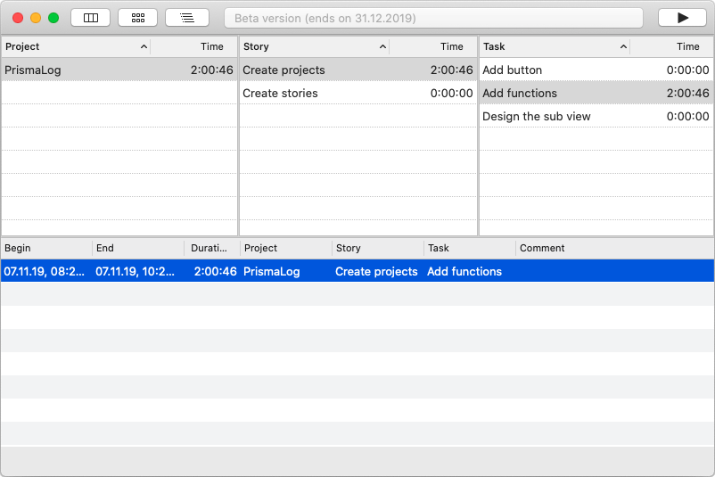

PrismaLog - The simple time tracking application
------------------------------------------------

- no registration
- no abonnement
- no collection of addresses or other personal data
- no use of third-party providers in the app
- no exchange of personal data
- no exchange of data with third-party services
- no cookies

The Idea
--------

The idea behind PrismaLog is to use a simple time tracking application for working at home ("home office"), in agile projects or in other "project environments" (university, school, private projects, ...).

With PrismaLog, the focus is on the simplest possible time recording with a clearly defined specification of a 3-level hierarchy. First the projects are defined, then the stories and then the tasks. In this hierarchy, as many log entries as desired will be created for each task.

PrismaLog has been intentionally reduced to a few features. Reporting, analytics, invoicing, scheduling and many other tasks can be done with the exported data in other applications.

Introduction
------------

After startup, the application shows all existing projects (or empty tables). The layout shows projects, the corresponding stories for each project and the tasks for each project. A multiple number of log entries can be created for each task.

<Strong>Note:</Strong> Double click on a row opens the edit mode for the clicked entry.

### Content

- Definition
- Functions
- Feature list
- [Privacy Policy](privacy_policy.md)

Definition
----------

A project is a distinct target of related activities. Related activities (tasks) are summarized as stories. Since tasks can also be stopped, a task can contain a large number of logs.

For example: A story represents a user feature or use case. A task represents a set of engineering work.

Functions
---------

### Projects

Projects can be created at any time; a double-click on a project line opens project editing.

Each project (as well as each story and task) gets a name and can (optionally) get a comment.

To create new projects (stories or tasks), use the buttons in the toolbar. The left button is used to create a new project.

### Stories

The second button is used to create stories for a project. To do this, the corresponding project must be selected beforehand.

### Tasks

The third button for new tasks has to be used accordingly. Only after selecting a story a task can be created for this story.

The recording of the time can be started after a task has been selected (the button with the triangle on the right hand side of the toolbar).

### Duplicating projects and stories

Duplicating projects or stories means that the complete project (story) structure will be copied with the same names AND without (!!!) logged entries.

<Strong>Note:</Strong> Duplicating a single task is not possible.

To duplicate a project or a story use the short cut *CMD + D* or click the menu function "Edit -> Duplicate".

### Editing tasks, stories, project or log entries

Each Entry can be edited to give them an other name, a comment or move it to an other project structure. Here for example a task:

This is also usable to editing log entries:

### Status bar window

With the status bar icon it's possible to open a small window (status bar window) as uick access to some functions. Here it is possible to re-open or quit the app, to stop the running log or to start/stop a favorite task.

To use a task as a favorite task in the status bar window, it is necessary to tick the favorite icon in the edit mode of a task.

### Favorites

Favorites are used to quickly start and stop a task. A favorite can be set in a task. Double click on a task entry and click the favority icon (on or off).

<Strong>Note:</Strong> Adding new favorites is only possible with stopped logging. 

If a task is set as a favorite a new entry is available in the status bar of the PrismaLog Mac OS Icon.

In the status bar it is also possible to reopen the window of the application or to close the application.

### Managing favorites

Each Favorite is listed in the favorite list which can be opened with the favorite button in the tool bar. Here it is possible to delete a favorite. To set a task as a new favorite it is necessary to double click this task and tick the favorite icon.

### Export

The recorded log entries can be exported as a csv file. This makes it possible to import them into other applications in order to analyze the workload.

<Strong>Note:</Strong> Only the log entries are exported. Projects, stories and tasks without log entries will not be exported!

The export function can be found in the menu bar of the application at "File -> Export"

Feature list
------------

Note: Double click on a row opens the edit mode for the clicked entry.

### Toolbar

- Button for creating a new project
- Button for creating a new story
- Button for creating a new task
- Button for managing favorites
- Button for starting/stopping logging
- Text box for information

### Projects

- List with names and time per project
- sortable columns
- double click opens edit mode to the clicked project
	- edit name and comment
	- Delete function

### Stories

- List with names and time per story
- sortable columns
- double click opens edit mode to the clicked story
	- edit name and comment
	- Delete function
	- Move story to different project (with all of the tasks and logs)

### Tasks

- List with names and time per task
- sortable columns
- double click opens edit mode to the clicked task
	- edit name and comment
	- set task as favorite
	- Delete function
	- Move task to different project and/or story (with all logs)

### Logs

- List with
	- begin
	- end
	- duration
	- project name
	- story name
	- task name
	- and comment
- sortable columns
- double click opens edit mode to the clicked log entry
	- Edit all entries (begin, end, comment, ...)
	- Delete log
	- Move log to different project and/or story and/or task

### Mac OS status bar

- start/stop logging of favorites
- reopen application window
- quit application

### Export

- Export a simple csv-file with basic information
- Export a detailed csv-file with IDs of all records

- - -

[Privacy Policy](privacy_policy.md)